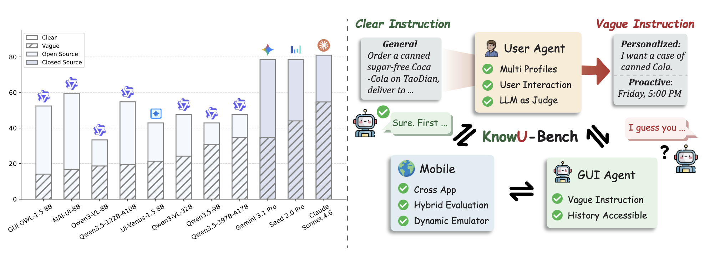
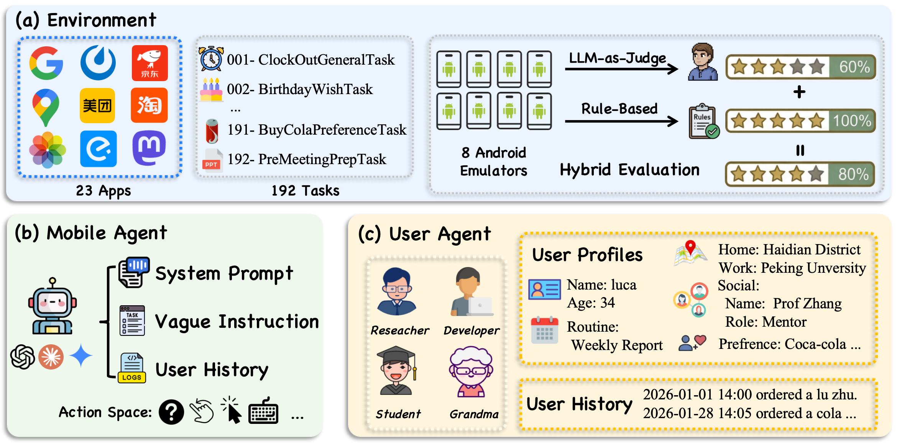

<div align="center">

<h1>KnowU-Bench: Towards Interactive, Proactive, and Personalized Mobile Agent Evaluation</h1>

Anonymous review version.


**KnowU-Bench** is an online, interactive benchmark for evaluating personalized and proactive mobile agents in reproducible Android environments.


</div>


<p align="center">
  
</p>

## Overview

Mobile GUI agents have made rapid progress on explicit task execution, yet a deeper challenge remains: can an agent act on your behalf as if it truly understands you? **KnowU-Bench** is designed to measure exactly this. It goes beyond standard GUI benchmarks by evaluating three capabilities that existing work leaves unaddressed — inferring user preferences from behavioral history, eliciting missing preferences through multi-turn interaction, and deciding when to intervene, seek consent, or remain silent in proactive settings.

<p align="center">
  
</p>

**Key design principles:**

- **Hidden profiles, exposed logs.** The user profile is kept hidden from the agent; only timestamped behavioral logs are provided. This forces genuine preference inference rather than context lookup.
- **Online user simulator.** An LLM-driven user simulator grounded in structured personas supports multi-turn clarification dialogues and proactive consent handling, enabling realistic agent-user interaction.
- **Full proactive decision chain.** Tasks require agents to decide whether to act, seek confirmation, or remain silent — and to respect user rejection — under programmatic verification and LLM-as-Judge scoring.

**Main findings from our paper:** Agents that excel at explicit GUI execution degrade substantially once success depends on knowing the user or deciding whether to act at all. Personalized failures are dominated by weak preference acquisition, and proactive failures by miscalibrated intervention, revealing a fundamental gap between competent interface operation and trustworthy personal assistance.

## 📰 News

- [2026-04-11] We have released the experiment Docker image for review.
- [2026-04-07] Code for KnowU-Bench is released.

## 📊 Benchmark Snapshot

| Item | Value |
| --- | --- |
| Benchmark name | KnowU-Bench |
| App coverage | 23 apps at benchmark scope |
| Registered tasks in current checkout | 192 |
| Task families | 42 general, 86 personalized, 64 proactive |
| Agent-user interaction tasks | 94 tasks tagged `agent-user-interaction` |
| User profiles | `developer`, `grandma`, `student`, `user` |
| Built-in agents | 9 |

The current Python task registry directly references 17 app identifiers in this checkout. Evaluation combines textual answer verification, backend database checks, local storage inspection, application callbacks, and hybrid evaluation flows for personalized tasks.

## 🚀 Installation

### Requirements

- Linux host with Docker
- KVM acceleration for the Android emulator
- Python 3.12
- uv

If your Docker setup requires root permissions, prepend `sudo` to the `mw env ...` commands below.

### Setup

```bash
git clone <anonymous-repository-url>
cd KnowU-Bench
uv sync
cp .env.example .env
```

Update `.env` with the credentials you actually need:

- `API_KEY`: model API key for the mobile agent
- `USER_AGENT_API_KEY`, `USER_AGENT_BASE_URL`, `USER_AGENT_MODEL`: user-agent configuration for interaction tasks

The default benchmark Docker image path is `ghcr.io/anonymous/knowu-bench:latest`.

If you want to pull it manually in advance:

```bash
docker pull ghcr.io/anonymous/knowu-bench:latest
```

## ⚡ Quick Start

### 1. Check host prerequisites

```bash
uv run mw env check
```

This verifies Docker, KVM, `.env`, and default image status.

### 2. Launch benchmark environments

```bash
uv run mw env run --count 4 --launch-interval 15
```

This starts four benchmark containers and exposes backend ports that `mw eval` can auto-discover.

### 3. Inspect tasks, agents, and apps

```bash
uv run mw info task --no-pager
uv run mw info agent
uv run mw info app
```

Useful variants:

```bash
uv run mw info task --name WeekendSleeperTask@student
uv run mw info task --filter lunch
uv run mw info task --export-excel artifacts/tasks.xlsx
```

### 4. Run an evaluation

The CLI still uses the code-level tags `general`, `preference`, and `routine`.

```bash
uv run mw eval \
  --agent-type qwen3.5 \
  --task ALL \
  --task-tags routine,preference,general \
  --model-name your-model-name \
  --llm-base-url https://your-openai-compatible-endpoint/v1 \
  --api-key "$API_KEY" \
  --max-round 50 \
  --max-concurrency 4 \
  --step-wait-time 3 \
  --log-file-root traj_logs/my_run \
  --enable-user-interaction
```

Important notes:
- Add `--enable-user-interaction` when you want tasks that may ask or respond to the user.
- Use `--user student` or another profile name to restrict evaluation to one persona.
- Use `--user-log-mode rag` and `--rag-backend embedding` to inject only top-k relevant user-log snippets.
- Use `--user-log-source noise` to evaluate robustness against noisy user histories.

### 5. View results

```bash
uv run mw logs results traj_logs/my_run
uv run mw logs view --log-dir traj_logs/my_run
uv run mw logs export --log-dir traj_logs/my_run -o exports/my_run
```

The log viewer gives you per-task trajectories, screenshots, actions, scores, and aggregate summaries.

## 🧰 Useful CLI Commands

- `mw env check`: check Docker/KVM prerequisites and image status
- `mw env run`: launch one or more benchmark containers
- `mw env list`: list active containers
- `mw eval`: run benchmark evaluation
- `mw test`: run a single task for debugging
- `mw device`: open the live Android device viewer
- `mw logs view`: launch the interactive web log viewer
- `mw info task/agent/app`: explore benchmark inventory

## 🤖 Built-In Agents

The current registry exposes these agent types:

`gelab_agent`, `general_e2e`, `gui_owl_1_5`, `mai_ui_agent`, `planner_executor`, `qwen3.5`, `qwen3vl`, `seed_agent`, `ui_venus_agent`

You can also pass a custom Python file path to `--agent-type` as long as it defines a class derived from `BaseAgent`.

## 📁 Repository Layout

Below, replace `src/<your_bench_package>/` with the package directory for your own benchmark.

```text
src/<your_bench_package>/tasks/definitions/      Benchmark task definitions
src/<your_bench_package>/user_profile/           Structured user personas
src/<your_bench_package>/user_logs/              Clean and noisy user histories
src/<your_bench_package>/agents/implementations/ Built-in agent baselines
src/<your_bench_package>/runtime/                Env client, controller, and app helpers
src/<your_bench_package>/core/                   CLI, orchestration, server, log viewer
scripts/                                 Evaluation runners and metric calculators
docs/                                    Setup and development guides
site/                                    Website and leaderboard assets
assets/                                  Project figures used in the repository
```

## 🛠 Development

For development workflows, container restart behavior, VNC debugging, and source mounting, see:

- [Development Guide](./docs/development.md)
- [Windows Setup](./docs/setup_for_windows.md)
- [AVD Configuration](./docs/configure_avd.md)

A common dev workflow is:

```bash
uv run mw env run --dev --vnc
uv run mw env restart knowu_bench_env_0_dev
uv run mw env exec knowu_bench_env_0_dev
```

The `scripts/` directory also contains batch runners and analysis helpers such as `run_eval.sh`, `run_gpt_e2e.sh`, `calc_paper_metrics.py`, and `calc_pref_routine_accuracy.py`.

## ⭐️ Citation

Citation metadata is omitted in this anonymous review version.

## 📄 License

This project is released under the Apache-2.0 License. See [LICENSE](./LICENSE) for details.
